# Azure Cost Optimizer Workshop

Build, run, deploy, and validate Azure Cost Optimizer in two 90-minute sprints.

> **Interactive public field guide:** [Open the Azure Cost Optimizer Workshop](https://gitpavleenbali.github.io/azure-cost-optimizer-workshop/). The public guide is read-only. Your facilitator provides the separate secure tracker URL for saved progress, evidence uploads, workshop kudos, and facilitator-reviewed results. Join that tracker with your workshop name, invite code, and a private passphrase of at least 12 characters. Remember the passphrase: it is not displayed or recoverable by other participants. Never reuse an organizational password.

| Start here | Purpose |
|---|---|
| [Part 1: Solution Tour](#part-1-solution-tour) | Understand the product, four architecture views and real examples. No commands or deployment actions. |
| [Part 2: Hands-On Workshop](#part-2-hands-on-workshop) | Check requirements, then follow the two timed sprints with ACO Workshop Builder. |

This README is the complete participant guide. You do not need to copy PowerShell commands: the Builder runs the supplied delivery contract and pauses for private sign-in or explicit approval.

# Part 1: Solution Tour

**Read and explore.** This first part explains what you will build and what the finished experience looks like. Hands-on activity begins in Part 2.

## Workshop Outcome

**Azure Cost Intelligence is the shared platform**, not just one component of Azure Cost Optimizer. Azure Cost Optimizer is the implemented workload in this workshop. The platform is intended to support further workloads such as solution-level token-cost analysis and architecture-based cost planning, with their own evidence adapters and calculation rules.

By 3:15 PM, each participant should have evidence for these outcomes:

1. The supplied product runs locally with sample evidence.
2. One explicitly selected Azure subscription is connected or its exact authorization blocker is recorded.
3. Cost, Advisor, inventory, freshness, and report behavior are understood.
4. The Azure deployment is complete or has a reviewed what-if and a precise external blocker.
5. The complete web application is smoke tested.
6. Agent ACO produces one validated answer and one evidence-backed report.
7. The participant shares a screenshot for visible-state review and records an optional cleanup decision.

This is a participant workshop, not production certification. A blocked Azure permission, model capacity wait, or resource propagation delay is a valid recorded outcome; it must not be hidden by using sample data as proof of live completion.

## What You Are Building

The solution:

- reads one explicitly selected Azure subscription;
- collects Azure Cost Management, Azure Advisor, and Azure Resource Graph evidence;
- keeps authoritative money and totals in deterministic decimal logic;
- exposes eight typed read-only tools to Agent ACO;
- streams five checked answer sections;
- renders charts, tables, decision paths, ownership plans, and reports;
- runs locally or as one Azure Container App;

It does not delete resources, purchase commitments, approve savings, or claim realized savings.

### Four Views, One Solution

| View | Question it answers |
|---|---|
| [1. Solution at a glance](#architecture-1-solution-at-a-glance) | How do the main components fit together? |
| [2. Shared platform](#architecture-2-azure-cost-intelligence-platform-and-workloads) | What can be reused by other cost workloads? |
| [3. Azure deployment](#architecture-3-azure-deployment-and-microsoft-foundry) | Which Azure service runs or stores each part? |
| [4. Data flow](#architecture-4-azure-cost-optimizer-data-flow) | What happens during collection, a question and a report? |

## Architecture 1: Solution At A Glance

This is the high-level view from Play 102, adapted to the workshop's current runtime and terminology. Read it first; the next three views expand the shared platform, the Azure resources, and the sequence of operations. Report downloads are rendered from the current snapshot, not read from stored PDF files.

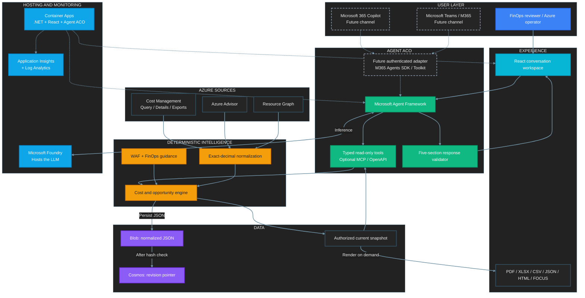
```mermaid
%%{init: {"theme":"dark","flowchart":{"curve":"basis","nodeSpacing":24,"rankSpacing":42,"padding":16},"themeVariables":{"fontFamily":"Segoe UI, sans-serif","fontSize":"15px","background":"#1f1f1f","primaryColor":"#252525","primaryTextColor":"#eeeeee","secondaryTextColor":"#eeeeee","tertiaryTextColor":"#eeeeee","titleColor":"#eeeeee","lineColor":"#7194a8","textColor":"#eeeeee","edgeLabelBackground":"#1f1f1f","clusterBkg":"#222222","clusterBorder":"#345568"},"themeCSS":"& { background: #1f1f1f; } .cluster-label text { fill: #eeeeee !important; } .cluster-label span, .cluster-label p, .edgeLabel p { color: #eeeeee !important; } .node p { color: inherit !important; } .node rect { rx: 0; ry: 0; }"}}%%
flowchart TB
    subgraph USER["USER LAYER"]
        User["FinOps reviewer / Azure operator"]
        Copilot["Microsoft 365 Copilot<br/>Future channel"]
        Teams["Microsoft Teams / M365<br/>Future channel"]
    end
    subgraph EXPERIENCE["EXPERIENCE"]
        Web["React conversation workspace"]
        Reports["PDF / XLSX / CSV / JSON / HTML / FOCUS"]
    end
    subgraph AGENT["AGENT ACO"]
        ACO["Microsoft Agent Framework"]
        Tools["Typed read-only tools<br/>Optional MCP / OpenAPI"]
        Validator["Five-section response validator"]
        ChannelAdapter["Future authenticated adapter<br/>M365 Agents SDK / Toolkit"]
    end
    subgraph INTELLIGENCE["DETERMINISTIC INTELLIGENCE"]
        Normalize["Exact-decimal normalization"]
        Engine["Cost and opportunity engine"]
        Knowledge["WAF + FinOps guidance"]
    end
    subgraph DATA["DATA"]
        Memory["Authorized current snapshot"]
        Blob["Blob: normalized JSON"]
        Cosmos["Cosmos: revision pointer"]
    end
    subgraph SOURCES["AZURE SOURCES"]
        Cost["Cost Management<br/>Query / Details / Exports"]
        Advisor["Azure Advisor"]
        ARG["Resource Graph"]
    end
    subgraph HOSTING["HOSTING AND MONITORING"]
        ACA["Container Apps<br/>.NET + React + Agent ACO"]
        Foundry["Microsoft Foundry<br/>Hosts the LLM"]
        Monitor["Application Insights<br/>+ Log Analytics"]
    end
    User --> Web
    Copilot -.-> ChannelAdapter
    Teams -.-> ChannelAdapter
    ChannelAdapter -.-> ACO
    Web --> ACO --> Tools --> Engine
    ACO --> Validator --> Web
    ACO <-->|Inference| Foundry
    Cost --> Normalize
    Advisor --> Normalize
    ARG --> Normalize
    Knowledge --> Engine
    Normalize --> Engine --> Memory
    Memory --> Tools
    Engine -->|Persist JSON| Blob
    Blob -->|After hash check| Cosmos
    Memory -->|Render on demand| Reports
    ACA -.-> Web
    ACA -.-> ACO
    ACA -.-> Monitor
    classDef user fill:#3b82f6,stroke:#2563eb,stroke-width:2px,color:#fff;
    classDef experience fill:#06b6d4,stroke:#0891b2,stroke-width:2px,color:#fff;
    classDef agent fill:#10b981,stroke:#059669,stroke-width:2px,color:#fff;
    classDef intelligence fill:#f59e0b,stroke:#d97706,stroke-width:2px,color:#17202a;
    classDef data fill:#8b5cf6,stroke:#6d28d9,stroke-width:2px,color:#fff;
    classDef source fill:#252525,stroke:#345568,stroke-width:2px,color:#eeeeee;
    classDef hosting fill:#0ea5e9,stroke:#0284c7,stroke-width:2px,color:#fff;
    classDef future fill:#252525,stroke:#94a3b8,stroke-width:2px,stroke-dasharray:6 4,color:#eeeeee;
    class User user;
    class Web experience;
    class ACO,Tools,Validator agent;
    class Normalize,Engine,Knowledge intelligence;
    class Blob,Cosmos data;
    class Cost,Advisor,ARG,Memory,Reports source;
    class ACA,Foundry,Monitor hosting;
    class Copilot,Teams,ChannelAdapter future;
    linkStyle default stroke:#7194a8,stroke-width:2px;
```

**Three invariants:** Azure evidence supplies observed facts; the deterministic engine calculates financial values; the Foundry-hosted model explains only authorized evidence.

**Dashed user-channel boxes are future integrations:** Microsoft 365 Copilot and Teams need a separately implemented, authenticated channel adapter and tenant approval. The current workshop ships the React workspace, not these channels. This means Microsoft 365 Copilot, not the GitHub Copilot Builder used to run the workshop.

## Architecture 2: Azure Cost Intelligence Platform And Workloads

Azure Cost Intelligence is the overarching five-layer platform. Azure Cost Optimizer uses it today; the dashed workloads show future extension points, not features shipped by this workshop. The diagrams that follow are specific to the implemented Azure Cost Optimizer workload.

[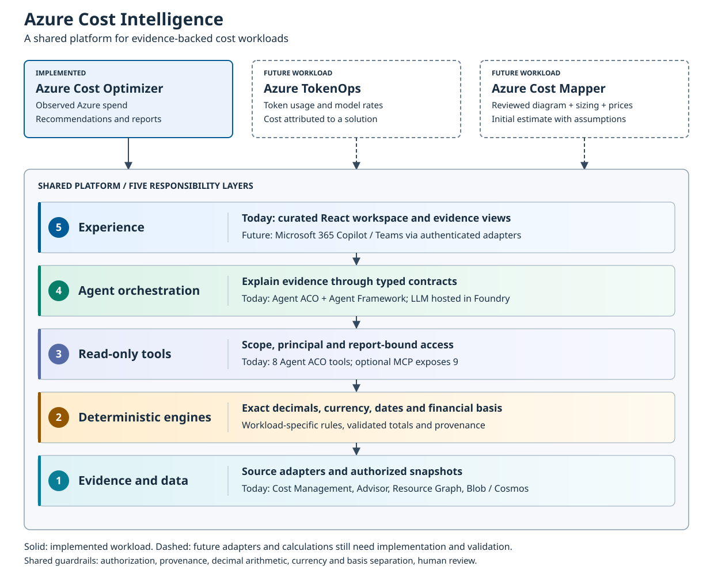](docs/assets/azure-cost-intelligence-platform.svg)

The colored layer bands distinguish responsibilities; the dashed workload outlines mean **future**, not active deployment. The light backgrounds and dark labels are intentionally self-contained so the graphic remains readable in both editor themes.

| Layer | Owns | Is not allowed to own |
|---|---|---|
| Azure evidence | Source payloads, authorization, period, freshness, completeness | Instructions embedded in source text |
| Deterministic intelligence | Totals, decimal arithmetic, eligibility, risk, report parity | Guessing missing evidence or mixing currencies |
| Typed tools | Minimized values and evidence IDs from the current authorized revision | Collection during an ordinary dashboard interaction |
| Agent ACO | Explanation, comparison, citations, and a human-reviewed next action | Authoritative totals, Azure mutation, prices, or approvals |
| Experience | Transparent evidence, status, uncertainty, and reports | Hiding stale, partial, estimated, or unsupported evidence |

| Workload | Evidence and calculation it needs | Delivery state |
|---|---|---|
| Azure Cost Optimizer | Observed Azure billing, Advisor and inventory, with billed/effective basis and currency preserved | Implemented in this workshop |
| Azure TokenOps | Measured input/output/cached token usage, model/deployment, applicable rates and solution attribution | Future workload; adapters and attribution still need implementation and validation |
| Azure Cost Mapper | A reviewed resource diagram plus region, SKU, quantity, utilization, licensing and dated prices | Future workload; produces an initial canonical estimate with explicit assumptions, not an invoice or guaranteed bill |

Another agent framework or workload can reuse the shared evidence, money, provenance and tool contracts once its adapter is implemented and tested. A diagram alone is insufficient to price a solution: the agent must ask for missing sizing and usage assumptions. Observed cost, token usage cost and a pre-deployment estimate must remain distinctly labeled.

The Experience layer is also extensible: the curated React workspace is implemented today; Microsoft 365 Copilot and Teams are future authenticated channels over the same authorized evidence and deterministic engine, not a replacement for them.

### What The Tool Layer Exposes

| Read-only tool | Purpose |
|---|---|
| `get_cost_summary` | Authoritative total, period and financial basis |
| `get_cost_breakdown` | Service, resource-group and daily dimensions |
| `get_advisor_findings` | Microsoft recommendations; estimates remain separate |
| `get_opportunities` | Evidence-backed review candidates |
| `get_data_health` | Freshness, coverage, exclusions and source status |
| `get_evidence` | Resolve citations to the authorized report |
| `create_report` | Render that revision into supported report formats; no Azure mutation |
| `get_optimization_guidance` | WAF and FinOps guidance, distinct from customer evidence |

MCP is an optional **transport over these same tools**, not a second optimizer. Its ninth tool, `describe_data_sources`, describes provider boundaries. Every call checks scope and reads the published snapshot; tool discovery does not collect costs or invoke a model. The bonus section includes a capture of the real nine-tool discovery response.

## Architecture 3: Azure Deployment And Microsoft Foundry

The physical topology shows **where the workload runs, which identity crosses each trust boundary, and how evidence, deployment, inference, and telemetry flow**.

[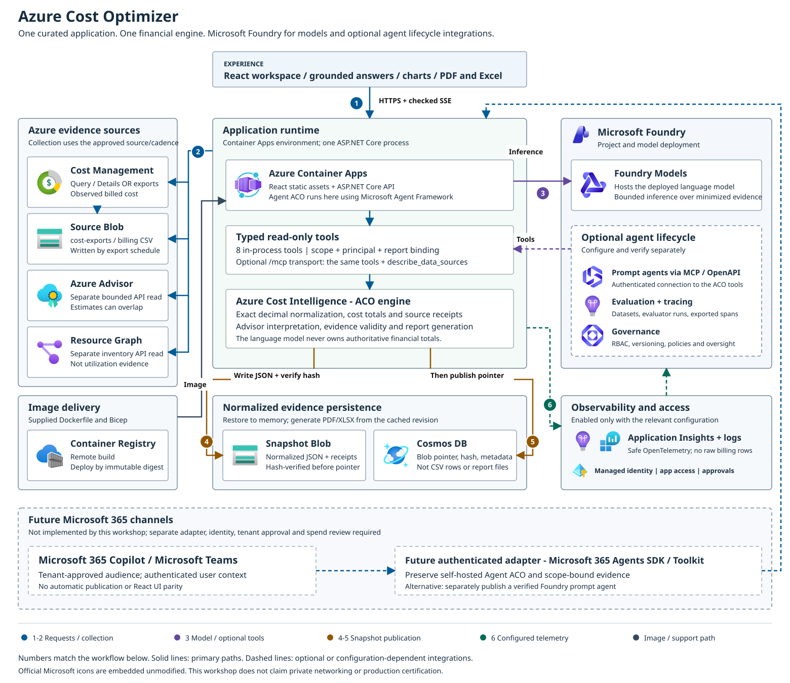](docs/assets/azure-cost-optimizer-deployment-topology-v2.svg)

Open the diagram for its full-size view. The official Azure icons are embedded in the SVG itself, so they also render when the README displays it as an image.

### How To Read The Topology

| Marker | Path | What happens |
|---|---|---|
| **1 - Blue** | Experience to application | HTTPS request and checked SSE response. The delivery contract applies the access boundary. |
| **2 - Blue** | Application to sources | An approved collection reads Query/Details **or** export CSV, plus separate Advisor and Resource Graph reads. Not a request per question. |
| **3 - Violet** | Application to Foundry | Microsoft Foundry hosts the LLM. Agent ACO runs in Container Apps and sends minimized typed evidence for approved inference. |
| **4 - Amber** | Engine to Snapshot Blob | Write normalized JSON, then read it back and verify its hash. The arrow enters the node from the side, not through the panel title. |
| **5 - Amber** | Engine to Cosmos | Only after step 4 succeeds, publish the current revision pointer and metadata. |
| **6 - Green** | Application to observability | Export configured telemetry to Application Insights/logs. No credentials or raw billing rows. |

Color is supplemented by numbers and labels, not used alone. **Solid lines** are primary paths; **dashed lines** are optional or configuration-dependent. The unnumbered grey support path is the digest-pinned ACR image. Managed identity and application authorization apply across service calls.

The **Foundry Models** icon is the official Microsoft Azure Architecture Icons V24 asset, copied without modification. It specifically represents model hosting; the separate Foundry Agent Service and Control Plane icons describe optional lifecycle capabilities, not the primary Agent ACO runtime.

The **Microsoft Foundry** heading also carries the general official Foundry service icon. All Azure icons in this topology are byte-matched to the V24 source pack; they are not hand-drawn approximations. The dashed **Future Microsoft 365 channels** panel is a proposed integration boundary, not a deployed resource: it requires a channel adapter, authentication, app registration/manifest, tenant review, and separately approved hosting/inference costs.

**Foundry has two distinct roles here.** The selected model deployment serves inference for the Agent Framework supervisor running in Container Apps. Separately, Foundry can support prompt-agent connections, evaluation datasets and runs, tracing, and governance controls. Those lifecycle integrations need explicit configuration, permissions and evidence: provisioning a Foundry project does not automatically activate them. Solid paths show the primary workload; dashed paths are optional or configuration-dependent.

This deliberately differs from the [Microsoft Foundry chat baseline](https://learn.microsoft.com/azure/architecture/ai-ml/architecture/baseline-microsoft-foundry-chat): the workshop's primary Agent ACO runtime is self-hosted in Container Apps, not silently moved to Foundry Agent Service. The diagram does not claim private networking or production certification.

### Where The Cost Evidence Lives

**There are two different Blob uses, and neither is the model's memory.**

| Location | Written by | What it contains | Read by |
|---|---|---|---|
| Source Blob container, typically `cost-exports` | Azure Cost Management Exports after an approved export definition and schedule are configured | Billing CSV files. The supplied importer expects its supported CSV layout, dates and monthly folder structure; it is not a general FOCUS/Parquet ingestion service | The cost collector, when `exports` is selected |
| Normalized Blob container, typically `normalized-evidence` | The application's hosted snapshot store | A JSON snapshot envelope containing normalized totals/breakdowns, Advisor findings, inventory evidence, receipts, scope, period, currency and collection/authorization timestamps | Hosted restore, which verifies identity, freshness and content hash before use |
| Cosmos DB, typically `aci` / `snapshots` | The application, **after Blob read-back hash verification** | A small scope-partitioned pointer document: Blob name/hash/size, report ID, period, currency/basis, canonical total and timestamps. Not the raw billing rows, PDF files or chat history | Hosted restore, to locate the matching Blob revision |
| In-process authorized snapshot | Successful collection or validated durable restore | The current normalized evidence revision | Dashboard APIs, Agent ACO's typed tools, and report generation |
| PDF / XLSX / other download | The report endpoint, on request | A deterministic rendering of the current snapshot | The participant's browser; current code does **not** automatically archive every generated report to Blob |

An export is one supported **input**, not a prerequisite for Agent ACO. Query and explicitly selected Cost Details are alternative cost collectors. Advisor and Resource Graph are separate bounded API reads; the billing export does not contain their evidence. In local mode the hosted Blob/Cosmos pair is not required: the app uses memory and, where supported, its Windows encrypted snapshot cache.

The supplied export importer currently selects the newest CSV per requested month (up to four months, 16 MiB per file). It does not assemble multipart export manifests or decompress files. Verify that the selected export matches those limits before treating it as complete; larger or partitioned exports need a separate ingestion enhancement.

### Automatic Updates Without Per-Question Collection

| Stage | What can run automatically after approval | What it does not do |
|---|---|---|
| Cost Management export schedule | Azure writes billing files to the chosen source Blob container, commonly daily | Does not immediately update the application's normalized snapshot |
| App's scheduled collection | An explicitly configured live refresh interval re-imports available CSVs and refreshes Advisor/inventory, normalizes and publishes a revision | Does not trigger a new Azure export run or make delayed billing data real-time |
| Agent question / chart / report | Reads the existing authorized snapshot; model-backed questions use the Foundry LLM | Does not query Cost Management or read the raw export through the LLM |

The intended participant experience is **approve the source and cadence once, then let the configured collection run**. The Builder handles the operation; participants do not type a refresh HTTP request. The supplied workshop currently defaults to Query and **scheduled refresh disabled**. Automatic mode is supported, but selecting exports and enabling a schedule requires verified export access, an initial usable dataset, an approved cadence and configuration. This documentation change does not silently turn it on. The runtime accepts intervals from 15 minutes (capped at 24 hours) and currently schedules the default month-to-date window; other periods use their own approved collection or cached revision.

**Direct APIs are not forbidden, and throttling is not inevitable.** Repeated interactive Cost Management queries can exhaust shared quotas and return `429`; the app must not make one Query call for every chart or agent question. For recurring analysis, scheduled exports plus snapshot reuse avoid that Query pressure. Blob, Advisor, Resource Graph and Foundry still have their own limits. Re-importing the same daily export every few minutes cannot reveal costs Azure has not published. On a failed/throttled refresh, keep prior evidence only while its authorization and freshness remain valid, disclose the failure and `Retry-After`, and never spin in immediate retries.

The Query API meters cost in query processing units (QPU), and **those quotas are per tenant, not per subscription**: 12 QPU per 10 seconds, 60 per minute, and 600 per hour, with roughly one QPU per month of data queried. A wider window therefore costs more: month-to-date or seven days is about one QPU, while three months is about three. Several participants in the same tenant refreshing several windows at once is the realistic way to exhaust that shared budget, so prefer **This month** during the session and stagger refreshes rather than clicking together.

**One collected snapshot changes the failure mode.** With no snapshot for the selected scope and period, a `429` leaves the dashboard blocked and the workspace reports that no snapshot is available with the next eligible refresh time. Once a valid snapshot exists, the same `429` no longer blocks anything: the previously validated evidence is returned unchanged and keeps its own freshness status, while the attempt is disclosed separately as `deferred-throttled` with the failed source, a retry time, and a single throttled receipt that is replaced rather than accumulated on each poll. A retry circuit then suppresses further provider calls until that retry time passes. A durable snapshot stays valid for 24 hours and is keyed to its cost source and period, so a Query-mode snapshot is not reused by a Cost Details run, and each window is collected separately.

Ask the Builder: `Explain my selected cost source and current refresh cadence. If I want automatic export ingestion, verify the existing CSV export and permissions, propose the bounded schedule and cost implications, and wait for approval before changing configuration. Keep all dashboard and Agent ACO questions snapshot-backed.`

Microsoft references: [Cost Management automation, latency and quotas](https://learn.microsoft.com/azure/cost-management-billing/costs/manage-automation) and [scheduled exports, storage destinations and partitioning](https://learn.microsoft.com/azure/cost-management-billing/costs/tutorial-export-acm-data). The runtime's minimum interval is a capability, not a recommendation to repeatedly query Cost Management at that interval.

### Microsoft Service References

| Evidence | Runtime and identity | Data and AI | Operations |
|---|---|---|---|
| [Cost Management](https://learn.microsoft.com/azure/cost-management-billing/costs/quick-acm-cost-analysis) | [Azure Container Apps](https://learn.microsoft.com/azure/container-apps/overview) | [Blob Storage](https://learn.microsoft.com/azure/storage/blobs/storage-blobs-introduction) | [Application Insights](https://learn.microsoft.com/azure/azure-monitor/app/app-insights-overview) |
| [Azure Advisor](https://learn.microsoft.com/azure/advisor/advisor-overview) | [Managed identities](https://learn.microsoft.com/entra/identity/managed-identities-azure-resources/overview) | [Cosmos DB Serverless](https://learn.microsoft.com/azure/cosmos-db/serverless) | [Log Analytics](https://learn.microsoft.com/azure/azure-monitor/logs/log-analytics-overview) |
| [Azure Resource Graph](https://learn.microsoft.com/azure/governance/resource-graph/overview) | [Azure Container Registry](https://learn.microsoft.com/azure/container-registry/container-registry-intro) | [Microsoft Foundry](https://learn.microsoft.com/azure/ai-foundry/what-is-azure-ai-foundry) | [Azure Monitor](https://learn.microsoft.com/azure/azure-monitor/overview) |

## Architecture 4: Azure Cost Optimizer Data Flow

This Azure Cost Optimizer sequence shows the export path, the alternative direct cost sources, and the separate normalized persistence step. Collection is an approved background operation, not an action the user must perform for every question. The LLM is hosted in Microsoft Foundry; Agent ACO and the deterministic engine run in the application.

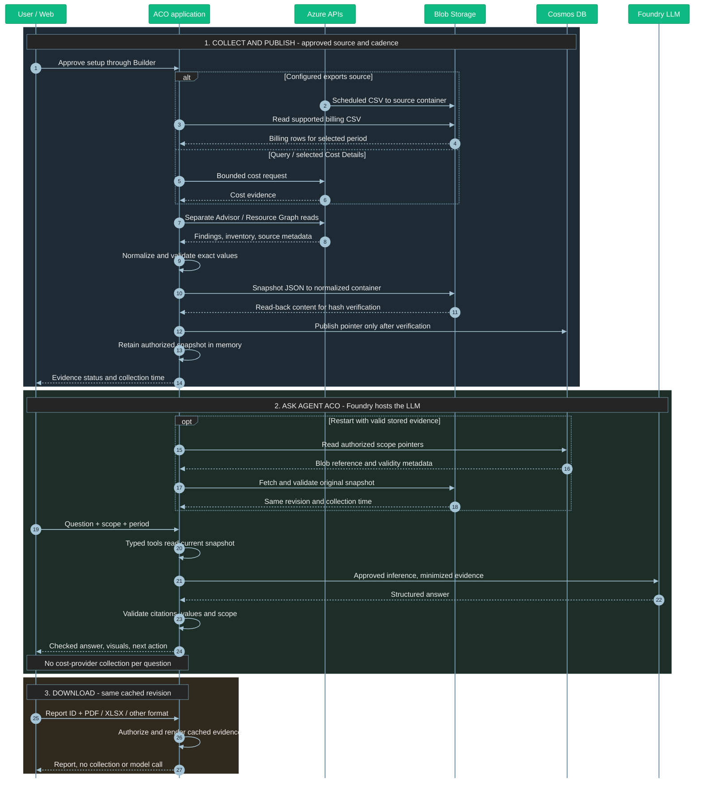
```mermaid
%%{init: {"theme":"dark","sequence":{"mirrorActors":false,"actorMargin":40,"width":135,"height":42,"diagramMarginX":12,"messageMargin":20,"boxMargin":8,"noteMargin":8,"wrap":false},"themeVariables":{"fontFamily":"Segoe UI, sans-serif","fontSize":"14px","background":"#1f1f1f","textColor":"#eeeeee","lineColor":"#7194a8","actorBkg":"#10b981","actorTextColor":"#ffffff","actorBorder":"#059669","actorLineColor":"#7194a8","signalColor":"#a5c4d5","signalTextColor":"#eeeeee","labelBoxBkgColor":"#252525","labelBoxBorderColor":"#7194a8","labelTextColor":"#eeeeee","noteBkgColor":"#252525","noteTextColor":"#eeeeee","noteBorderColor":"#7194a8","loopTextColor":"#eeeeee","activationBkgColor":"#10b981","activationBorderColor":"#059669","sequenceNumberColor":"#17202a"},"themeCSS":"& { background: #1f1f1f; } rect.actor { rx: 0; ry: 0; } rect.actor[name=User] { fill: #3b82f6; stroke: #2563eb; } rect.actor[name=Azure] { fill: #252525; stroke: #345568; } rect.actor[name=Blob], rect.actor[name=Cosmos] { fill: #8b5cf6; stroke: #6d28d9; } rect.actor[name=Model] { fill: #0ea5e9; stroke: #0284c7; }"}}%%
sequenceDiagram
    autonumber
    participant User as User / Web
    participant App as ACO application
    participant Azure as Azure APIs
    participant Blob as Blob Storage
    participant Cosmos as Cosmos DB
    participant Model as Foundry LLM

    rect rgb(31, 43, 52)
        Note over User,Cosmos: 1. COLLECT AND PUBLISH - approved source and cadence
        User->>App: Approve setup through Builder
        alt Configured exports source
            Azure->>Blob: Scheduled CSV to source container
            App->>Blob: Read supported billing CSV
            Blob-->>App: Billing rows for selected period
        else Query / selected Cost Details
            App->>Azure: Bounded cost request
            Azure-->>App: Cost evidence
        end
        App->>Azure: Separate Advisor / Resource Graph reads
        Azure-->>App: Findings, inventory, source metadata
        App->>App: Normalize and validate exact values
        App->>Blob: Snapshot JSON to normalized container
        Blob-->>App: Read-back content for hash verification
        App->>Cosmos: Publish pointer only after verification
        App->>App: Retain authorized snapshot in memory
        App-->>User: Evidence status and collection time
    end

    rect rgb(29, 46, 40)
        Note over User,Model: 2. ASK AGENT ACO - Foundry hosts the LLM
        opt Restart with valid stored evidence
            App->>Cosmos: Read authorized scope pointers
            Cosmos-->>App: Blob reference and validity metadata
            App->>Blob: Fetch and validate original snapshot
            Blob-->>App: Same revision and collection time
        end
        User->>App: Question + scope + period
        App->>App: Typed tools read current snapshot
        App->>Model: Approved inference, minimized evidence
        Model-->>App: Structured answer
        App->>App: Validate citations, values and scope
        App-->>User: Checked answer, visuals, next action
        Note over User,App: No cost-provider collection per question
    end

    rect rgb(48, 41, 30)
        Note over User,App: 3. DOWNLOAD - same cached revision
        User->>App: Report ID + PDF / XLSX / other format
        App->>App: Authorize and render cached evidence
        App-->>User: Report, no collection or model call
    end
```

### Data-Flow Guarantees

- Blob content is hash-verified before Cosmos publishes the current pointer.
- Source billing exports and normalized snapshot JSON have different producers and storage locations.
- Cosmos contains pointer metadata, not raw billing rows or LLM input documents.
- Dashboard navigation and report opening do not trigger Azure collection.
- Agent ACO tools read one authorized revision and never mutate Azure.
- The model receives minimized evidence, never credentials or raw billing rows.
- Numeric claims and generated reports resolve to the same report revision.
- Only `done.validated=true` marks a successful model-backed answer.

## Meet Agent ACO

**Agent ACO** is the conversational supervisor inside Azure Cost Optimizer. It is built with Microsoft Agent Framework and can use eight typed read-only tools to inspect the current authorized evidence revision. It explains cost drivers, compares time windows, interprets Advisor findings, applies Well-Architected and FinOps guidance, builds decision and ownership artifacts, and generates reports.

Agent ACO does **not** collect cost data during a question, calculate authoritative totals with a language model, mutate Azure, purchase commitments, or approve savings. Azure Cost Intelligence performs the deterministic calculations; Agent ACO explains that evidence and cites it.

Every successful answer contains five validated sections:

1. Answer
2. Evidence
3. Data health
4. Risks
5. Next action

Only `done.validated=true` is success.

### The Real Product Participants Receive

These are captures from the running Azure Cost Optimizer product, not mockups. They show September 2026 evidence and validated full-review responses. Each table/chart pair comes from the same captured revision; later captures can differ from earlier report pages as billing accrues. Costs are retained in the detailed examples; the monthly total in the opening workspace image is hidden. Private resource-group names and report identifiers are redacted. These historical values are neither pricing estimates for your workshop nor promised savings. Some images are excerpts rather than the entire answer.

**Live cost workspace - monthly total hidden**

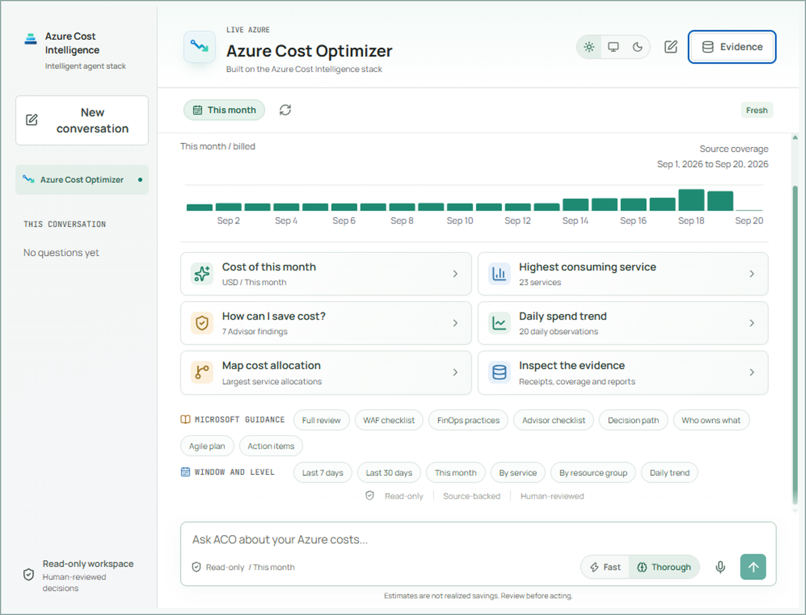

### Answer And Cost Breakdown

The answer identifies the period, billed cost and cost drivers. You can then inspect services and resource groups separately, using the same published evidence.

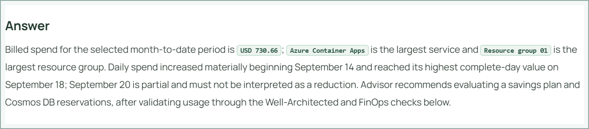

**Service cost - evidence and bar chart:** inspect the eight displayed amounts above the matching bars. The evidence table is expanded so the chart can be checked against its values.

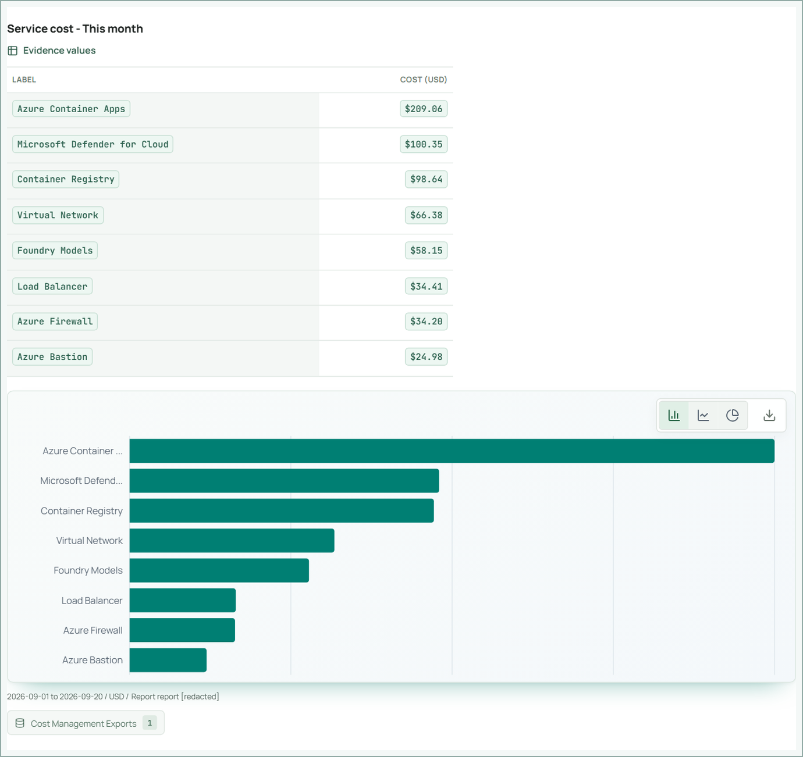

**Resource-group cost - evidence and share-of-spend pie:** compare the eight displayed groups and their amounts with the app's pie/doughnut view. Percentages describe the displayed series, not necessarily all subscription costs. Group names are redacted; values and slice proportions are unchanged. The app enables this view only for a positive-valued series that can meaningfully represent shares.

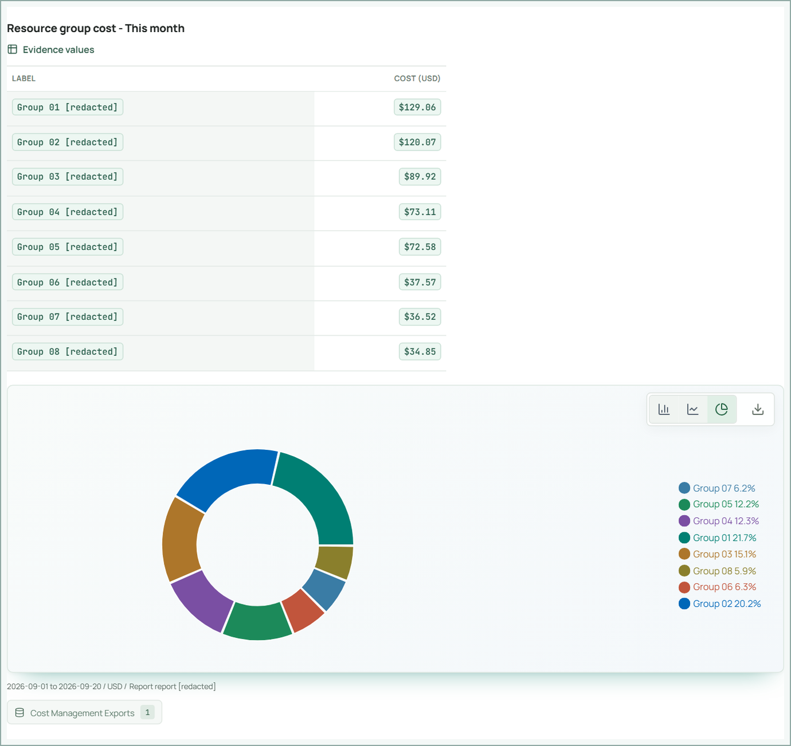

### Advisor, Well-Architected And FinOps

**Advisor review candidates:** inspect each estimate and its evidence. Similar findings can overlap; do not add them as realized savings.

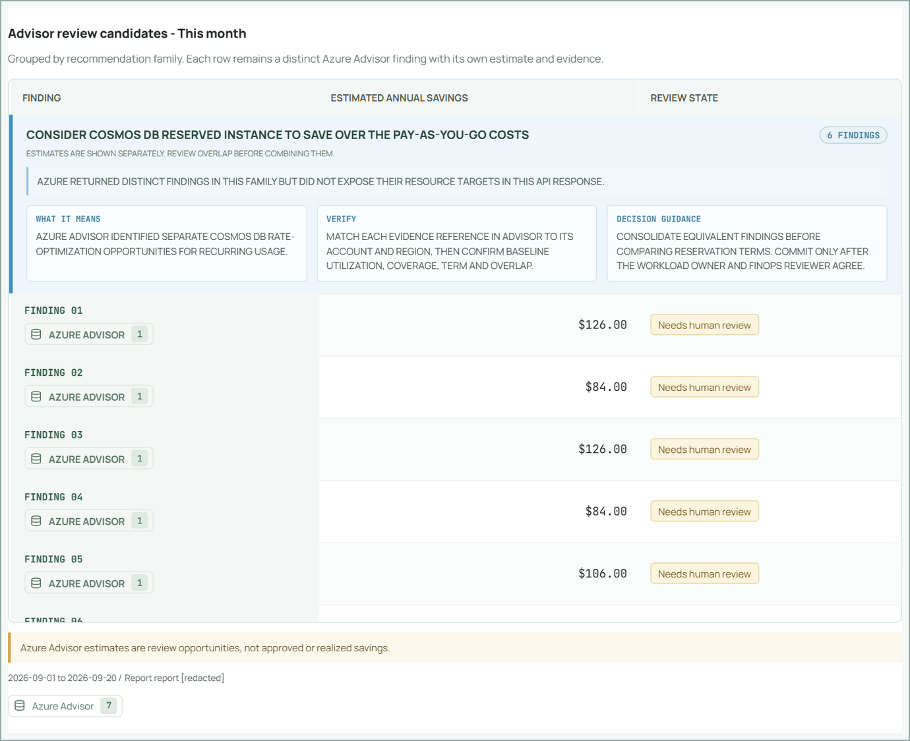

**Well-Architected checklist:** review the applicable cost-optimization checks. This is published guidance, not measured customer savings.

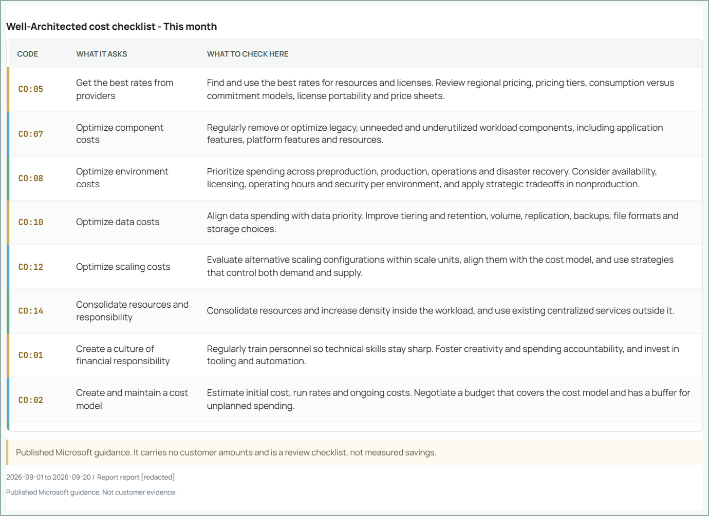

**FinOps practices:** connect the evidence to Inform, Optimize and Operate activities, with accountable roles.

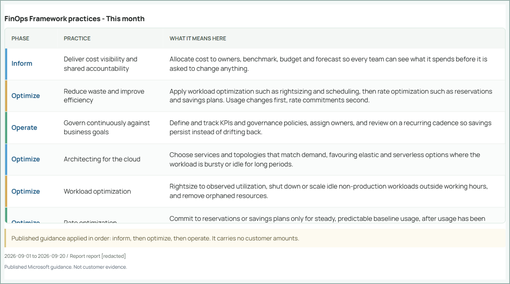

### Delivery Backlog And Next Action

**Azure DevOps-ready backlog:** a proposed work-item snippet with user stories, accountable roles and done-when criteria. This is a backlog preview, not a ticket created in Azure DevOps. Creating tickets requires a separately implemented and approved integration.

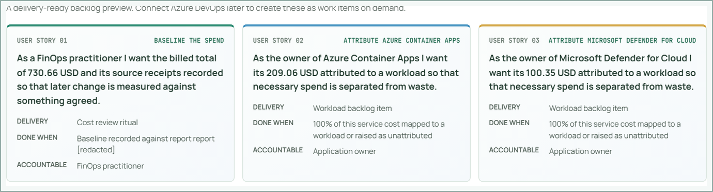

**Next action:** the answer ends with an owner and a concrete evidence-based investigation, not an automatic resource change.

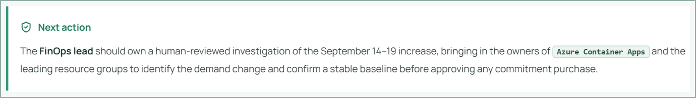

### Real PDF And Excel Output

These previews were rendered from the application's actual PDF and XLSX downloads. The PDF images show pages 3 and 4 of that report; identifiers are masked. The Excel preview was exported by Microsoft Excel from the **Cost breakdown** worksheet and cropped to the service-cost region. Amounts, bars and native charts were not recreated for these pictures.

**PDF: report summary and service-cost bars**

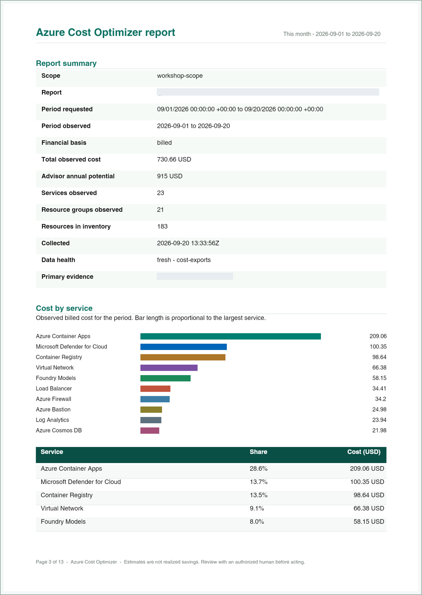

**PDF: service costs and share-of-spend chart**

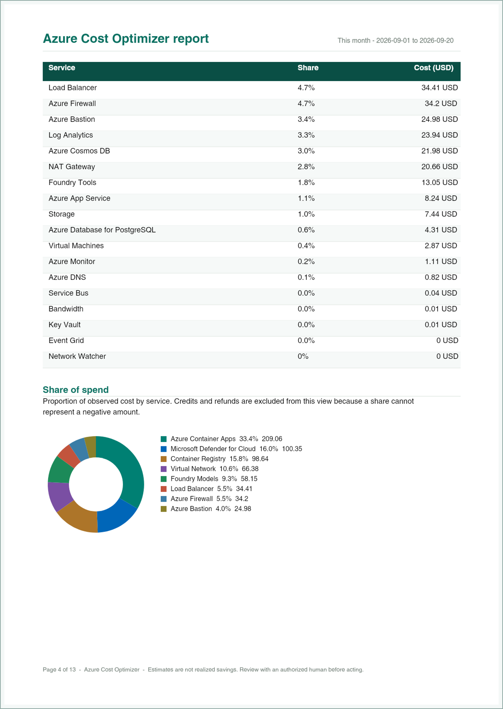

**Excel: Cost breakdown worksheet**

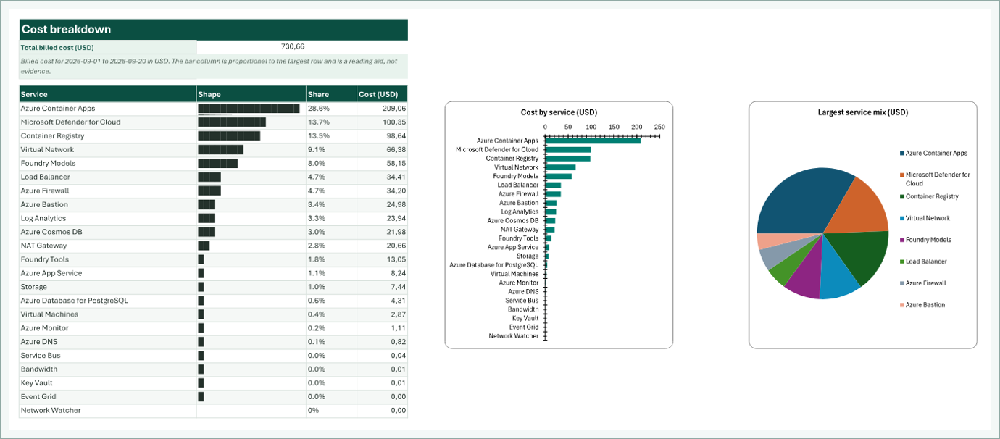

**Evidence health and generated reports**

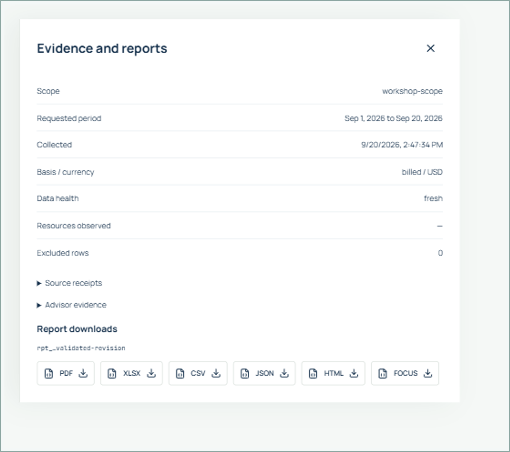

Participants can ask for a full cost review, inspect sources, switch chart modes, download a chart image, and generate PDF, Excel, CSV, JSON, HTML, and FOCUS outputs from the same validated report revision.

The VS Code custom agents are workshop roles, not extra production agents:

| Custom agent | Use it for |
|---|---|
| **ACO Workshop Builder** | Participant journey, questions, operations, plans, validation, and approval stops |
| **ACO Workshop Reviewer** | Financial truth, authorization, privacy, contracts, reports, and deployment review |
| **ACO Workshop Tuner** | Measured latency, caching, model use, and stability after correctness passes |

Use **ACO Workshop Builder** throughout the two sprints. Invoke Reviewer or Tuner only when requested.

---

# Part 2: Hands-On Workshop

**Now take action.** Everything above is the solution tour. Start here with your own workspace, subscription and approvals; the supplied product and design stay unchanged.

| Sprint | Monday time | Outcome |
|---|---|---|
| Sprint 1: Connect the dots locally | 11:30 AM-1:00 PM | Run the supplied product locally, connect authorized evidence, and record any blockers. |
| Break | 1:00 PM-1:45 PM | Lunch; no new unattended write. |
| Sprint 2: Deploy and experience Azure | 1:45 PM-3:15 PM | Deploy the curated app, validate Agent ACO, generate a report, and share a screenshot. |

## Set Up Copilot For A Guided Workshop

Open the **extracted workshop folder itself** in VS Code, open Chat, and select **ACO Workshop Builder**. Use the current folder, not a new worktree or a cloud/background session. The product's **Agent ACO** lives in the web application; it is not the VS Code Builder.

| Chat control | Workshop choice |
|---|---|
| Agent picker | **ACO Workshop Builder**, not Ask, Plan, or Autopilot |
| Permissions dropdown beside the chat input | **Manual** in current Copilot sessions; **Default Approvals** in versions that use that label |
| Allow all / Bypass Approvals | Leave off. Do not enable `/yolo` or `/autoApprove`. |
| Autopilot / Advanced Autopilot | Leave off; these can continue working and answer blocking questions automatically. |
| Model picker | An organization-approved coding model, or Auto when available. This is separate from the Azure model used by Agent ACO. |
| Tool approval dialog | Review the operation and select the one-time **Allow** option. Avoid trusting all terminal or Azure tools for the session/workspace. |

In VS Code Settings, check that `chat.tools.global.autoApprove` is **off**. For the most explicit workshop review, turn `chat.tools.terminal.enableAutoApprove` **off** so terminal commands require confirmation. Use **Chat: Manage Tool Approval** to inspect saved approvals; **Chat: Reset Tool Confirmations** clears them when needed. Labels and available controls depend on the VS Code version and session type. Respect organization-managed restrictions; do not bypass them or change everyone else's settings from a shared workspace file.

**Permissions and pacing are different.** Manual/Default Approvals does not automatically stop an agent after a README step, and saved approvals can still allow tools to run. The supplied Builder and kickoff prompt request one numbered step per turn. At each checkpoint, read the result and send the next step's prompt yourself. These are agent instructions, not a technical guarantee: use **Stop** immediately if the agent moves beyond the requested step, then ask it to report what ran and wait. A tool's Allow button is not approval for new Azure scope, spend, or deployment.

Official reference: [VS Code approvals and permissions](https://code.visualstudio.com/docs/agents/run/approvals).

## How Guided Delivery Works

| Step | Owner | What happens |
|---:|---|---|
| 1 | Participant | Describe the desired outcome in normal language. |
| 2 | ACO Workshop Builder | Prepare the next delivery-contract operation. |
| 3 | Participant | Review scope, cost and risk when approval is required. |
| 4 | ACO Workshop Builder | Execute only the approved operation and validate the result. |
| 5 | Shared checkpoint | Save evidence, blockers and the next decision, then stop until the participant requests the next numbered step. |

The participant owns decisions and credentials. The Builder owns orchestration. The deterministic engine owns financial truth. The model owns explanation only.

## Non-Negotiable Safety Rules

- Never paste passwords, tokens, keys, or client secrets into chat.
- Pass the selected subscription explicitly; never change the global Azure CLI default.
- Stop before Azure reads, resource creation, role assignment, model deployment, paid inference, public access, deployment, or deletion.
- A successful what-if is evidence, not approval.
- Subscription Owner does not prove Cost Management or Foundry data-plane access.
- Use Bicep Incremental mode and deploy images by immutable digest.
- Azure Advisor values are estimates and can overlap; they are not approved targets or realized savings.
- Compare the same subscription, exact dates, `ActualCost` basis, currency, and collection time before claiming parity.
- `SecurityControl` is participant-supplied policy metadata, never a universal bypass or replacement for security controls.

## Workshop Requirements And Preparation

Participants need the following before Sprint 1:

| Requirement | Workshop use |
|---|---|
| Windows 11 with Windows PowerShell 5.1 or PowerShell 7 | Runs the supplied preparation, local, and deployment scripts |
| Visual Studio Code | Workshop workspace and integrated terminal |
| GitHub Copilot Chat access | Runs **ACO Workshop Builder** and the prompt-led delivery contract |
| Git | Source and package integrity workflows |
| .NET 10 SDK | Builds and runs the supplied API and deterministic engine |
| Node.js 24 with npm | Builds the supplied React 19 frontend and runs validators |
| Azure CLI with Bicep | Selects the subscription, reviews what-if, and deploys the supplied IaC |
| One enabled Azure subscription | Hosts the participant-owned workshop resources |
| Cost read access plus resource-creation authority | Reads Cost Management, Advisor, and Resource Graph and deploys the workshop stack |
| Access to an existing Microsoft Foundry project and compatible deployed model | Required for the full Sprint 1 Agent ACO exercise, even though the application runs locally; arrange access before the workshop |
| A modern browser | Uses the local and hosted Azure Cost Optimizer workspace |

**Docker is not required.** The workshop uses Azure Container Registry remote build.

The **Foundry Toolkit extension** is optional for the local application and recommended for the bonus prompt-agent exercise. The **Foundry model service** is a separate requirement for model-backed Agent ACO answers. Installing the extension or having a GitHub Copilot license does not provide the application's model deployment or inference access.

### Before Sprint 1: Arrange Foundry Model Access

**Local application does not mean local model.** In the full Sprint 1 exercise, React, the API, Agent ACO and the deterministic engine run on the participant's machine; approved inference goes to the selected cloud-hosted Foundry model. Do not wait until Sprint 2 to arrange that deployment if participants should experience Agent ACO during Sprint 1.

| Sprint 1 stage | Model needed? |
|---|---|
| Step 2: offline sample | No. Sample mode explicitly disables Azure and model calls. |
| Steps 5-7: live-local cost-only evidence and reports | No. Deterministic collection and reports can be checked without AI. |
| Step 8: model-backed Agent ACO on localhost | Yes. Reuse a compatible Foundry deployment with verified access and separate paid-inference approval. Supported Azure OpenAI access is an alternative. |

Before the workshop, the participant or facilitator should arrange:

- An existing Foundry project and its **project endpoint**, ending in `/api/projects/<project-name>`, plus the exact **model deployment name**. A catalog model name or a project with no deployed model is not sufficient.
- A deployment compatible with the supplied application's tool-calling and structured-response contract, with usable quota/capacity and an agreed inference budget. Reuse a verified deployment rather than assuming any available model will work.
- The participant's signed-in Azure identity, correct tenant, and the required Foundry data-plane permissions at the approved scope. Subscription Owner and Copilot access alone do not prove inference permission. Role assignment is a separate approved operation.
- Network access from the workstation to the project/model endpoint. Private endpoints, corporate proxies, or tenant policy can require approved connectivity; do not weaken access controls to bypass a blocker.
- Approval to send the selected minimized cost evidence to that model, including any organizational data-handling requirements. Keep credentials out of chat and committed files; configure only the selected endpoint/deployment through the supplied launcher.

The launcher accepts `FoundryProjectEndpoint` and `ModelDeploymentName`; the corresponding configuration names are `AZURE_AI_PROJECT_ENDPOINT` and `AZURE_AI_MODEL_DEPLOYMENT_NAME`. The Builder handles configuration. A Foundry prompt agent is **not** required for this local exercise: Agent ACO already runs in the supplied application. A shared facilitator model is usable only with explicitly granted participant access, approved evidence handling, and a shared capacity/spend plan.

Ask ACO Workshop Builder before the workshop:

```text
Prepare my model-readiness plan for Sprint 1's local Agent ACO exercise. Ask one question at a time for an existing Foundry project endpoint, deployment name, tenant, access and inference budget. Explain the discovery and access checks, then stop for approval before any Azure read or paid test. Verify model compatibility, capacity, identity and workstation connectivity after the matching approvals. Do not create resources, assign roles, or invoke a model automatically. Record ready, blocked, or deferred; model readiness is separate from workstation preparation. Stop after this preflight and do not advance the sprint.
```

If no suitable deployment exists, arrange a **separately approved pre-workshop setup** with the facilitator, including quota, region, cost and access review. Otherwise keep the local sample/cost-only path available and record **Agent ACO activation deferred**, not a completed AI exercise. Model creation in Sprint 2 does not retroactively complete Sprint 1 activation.

References: [Microsoft Foundry](https://learn.microsoft.com/azure/ai-foundry/what-is-azure-ai-foundry) and [Foundry role-based access control](https://learn.microsoft.com/azure/ai-foundry/concepts/rbac-azure-ai-foundry).

### Preparation Checker

The supplied [preparation script](scripts/prepare-workshop.ps1) checks required versions, Azure CLI and Bicep availability, ACR remote-build support, Copilot and Foundry Toolkit presence, cached Azure sign-in state, and workshop files. It installs nothing and changes neither the machine nor Azure. A producer checkout verifies its archive against its manifest/receipt. An extracted participant ZIP intentionally has no producer metadata: it runs local structure/contract validation instead. That is not proof of archive authenticity; the facilitator verifies the downloaded ZIP against its external receipt before distribution. Do not invent missing producer files.

At the start of Sprint 1, ask the Builder:

```text
Run the workshop preparation checker for all tracks. Summarize what is ready and what is missing. For each required missing item, explain the official source and exact installation action, then ask for my approval one item at a time. Do not install, elevate, restart, sign in, or change Azure without my matching approval. Rerun the checker after approved remediation and preserve the result.
```

The script writes its nonsecret result to ignored workshop state. Copilot can then help install only approved missing prerequisites and resume without repeating completed checks. A `ready` preparation result verifies workstation/package prerequisites, **not** Foundry deployment availability, data-plane access, model compatibility, or successful inference; the model-readiness check above is separate.

### Facilitator Pre-Warm (Recommended Before The Session)

This step is for the facilitator, not each participant, and it is the single most effective protection against a throttled start.

Collect **one** snapshot per subscription that will be used live, ideally the evening before or well ahead of Sprint 1. The reason is the failure mode described in Part 1: with an empty cache a `429` blocks the dashboard, while an existing snapshot keeps serving validated evidence and discloses the throttled attempt separately. The durable snapshot remains valid for 24 hours.

Ask the Builder:

```text
Pre-warm one month-to-date snapshot for my selected subscription in cost-only mode. Show me the exact operations and provider-call budget first and wait for my approval. Make one bounded attempt only. If Cost Management returns 429, record the retry metadata and the next eligible time, do not retry in a loop, and tell me when I can try again.
```

Collect only the window the session will use, confirm the result reports a saved durable snapshot, and do not pre-warm every window. If the attempt is throttled, wait for the reported retry time and make one further attempt; repeated immediate retries make recovery slower, not faster.

# Sprint 1: Connect The Dots Locally

**Monday, 11:30 AM-1:00 PM**

**Definition of done:** the supplied product runs locally; sample behavior is proven; one selected subscription is checked; one bounded live refresh and parity comparison complete when authorized, or the exact blocker is recorded. The full agent exercise also requires one validated model-backed Agent ACO answer through the pre-arranged Foundry deployment or supported Azure OpenAI alternative. Cost-only is a valid fallback, but its agent exercise remains deferred and activation false.

## Sprint 1 Agenda

| Time | Activity | Checkpoint |
|---|---|---|
| 11:30-11:40 | Review the solution tour, four architecture views, Agent ACO and safety boundary | Participant can explain why the model is not the financial source of truth |
| 11:40-11:50 | Run the preparation checker with ACO Workshop Builder | One readiness report; missing prerequisites listed once |
| 11:50-12:05 | Build and run the local sample | `OFFLINE SAMPLE`; zero Azure and model calls |
| 12:05-12:20 | Sign in and explicitly select subscription/tenant | Verified enabled subscription without changing CLI default |
| 12:20-12:40 | Run live-local cost-only and one explicit refresh | Current evidence or exact 403/429/deferred state |
| 12:40-12:55 | Compare portal parity; connect the pre-arranged model for Agent ACO | Same basis/dates/currency; one validated grounded response, or explicit model blocker/deferred activation |
| 12:55-1:00 | Record Sprint 1 evidence and Sprint 2 decisions | Local checkpoint and approved/deferred Azure plan |

## Start Sprint 1 In Copilot

Select **ACO Workshop Builder** and send:

```text
Start Sprint 1 from README.md in one-step-at-a-time mode. Run Step 1 preparation only, ask at most one missing-input question at a time, report the checkpoint, and stop. Do not start Step 2 until I request it. Execute the supplied delivery contract instead of asking me to copy commands. Stop before every Azure read, write, role assignment, model deployment, paid inference, public access change, or deletion.
```

Send one numbered step prompt per turn. The kickoff above already requests Step 1; do not paste Step 1 again after it passes. The Builder records a checkpoint and stops after each step. Ask `Show my last checkpoint and the next numbered step. Do not execute it yet.` when resuming; then send the chosen step's prompt. A completed step or a tool-permission approval does not authorize the next step or any new Azure operation.

Checkpoints are saved to ignored `.workshop/checkpoint.json`, with the step, status, evidence-file references, blockers, and next proposed step. They contain no passwords, tokens, or keys. The Builder must read this file on resume and distinguish an approved action from one actually completed. Copy the fenced **text** prompt for the chosen step, not the whole sprint. The README is the participant path; separate slash-command shortcuts are not required.

## Step 1: Prepare The Workstation

Tell the Builder:

```text
Run scripts/prepare-workshop.ps1 for all tracks. Report everything missing once. Do not install anything until I approve the exact package and official source.
```

The Builder returns one readiness report, offers approval-gated remediation, reruns the checker, and stops when the workstation is ready. Preparation never changes Azure.

## Step 2: Build And Run The Local Sample

Tell the Builder:

```text
Prepare and start the supplied local sample. Use locked dependencies and the existing source. Do not redesign or regenerate the product. Open the local experience when it is ready and prove that sample mode makes zero Azure and model calls.
```

Verify:

- `OFFLINE SAMPLE` is visible;
- charts and reports work;
- no Azure provider or model call occurs;
- Ask ACO explains that AI is disabled in sample mode.

The Builder owns the process lifecycle and reports the local URL and stop state.

## Step 3: Select Azure Context

Tell the Builder:

```text
Guide me through direct Azure sign-in. I will complete credentials and MFA privately. Explain the subscription-list and verification reads and wait for my approval before running them. Then show enabled subscriptions with masked IDs, ask me to select one, verify its tenant and state, record Step 3, and stop. Never change my global Azure CLI default.
```

The Builder may open an interactive sign-in flow, but you enter every credential, device code, password, or MFA response directly. Nothing secret goes through chat.

## Step 4: Record Names, Ownership, And Policy Inputs

Tell the Builder:

```text
Ask me one question at a time for region, naming prefix, resource group, owner, expiry, and organization-required tags. Treat SecurityControl as participant-supplied policy metadata and leave it unset unless I provide an explicitly approved value.
```

The Builder validates naming constraints and stores selections only in ignored local workshop state.

## Step 5: Check Live Access

Tell the Builder:

```text
Prepare a read-only live access check for my selected subscription in cost-only mode. Show the exact operations, provider-call budget, and scope, then stop for my approval before making any Azure read.
```

The receipt remains private. Do not post tenant, subscription, principal, endpoint, or raw cost identifiers in shared chat.

## Step 6: Run Live-Local Cost-Only

Tell the Builder:

```text
Start live-local cost-only mode for my selected subscription. Do not collect at startup. When the app is ready, explain the one bounded refresh and ask before I trigger it.
```

The app does not collect at startup. Use **Refresh data** only after explicit read approval.

If Cost Management returns `429`, record the retry metadata and continue with sample/local validation. Do not retry repeatedly. If a source returns `403`, record the denied capability; do not assume authority to grant a role.

## Step 7: Compare Financial Parity

Tell the Builder:

```text
Help me complete Step 7 using the current ACO snapshot and my Azure Cost Management view. Ask me for the same-scope comparison one question at a time. Record matched, explained difference, or pending with the period, basis, currency and collection time. Do not collect again, change values, or claim a match from a screenshot alone. Save the checkpoint and stop.
```

Compare Azure Cost Optimizer with Azure Cost Management using:

- the same subscription;
- exact start and end dates;
- `ActualCost`;
- billed basis;
- the same currency;
- the displayed collection time.

Record `matched`, `explained difference`, or `pending`. Never adjust values to force a match.

## Step 8: Connect The Model For Local Agent ACO

Tell the Builder:

```text
For Step 8, reuse my pre-workshop model-readiness information and confirm the existing Foundry deployment or supported Azure OpenAI alternative for the local application. Propose discovery, access checks, configuration and one model-backed question separately, and wait for each corresponding approval. Keep sample mode model-free; use the supplied live-local path and authorized current evidence for the agent exercise without automatic recollection. Do not create resources or invoke a model from configuration approval alone. If access, model or inference approval is unavailable, record cost-only fallback, activation false and the agent exercise deferred. Save the checkpoint and stop.
```

Choose one outcome:

| Choice | Sprint 1 outcome |
|---|---|
| Cost-only fallback | Deterministic dashboard and reports work; agent exercise deferred and ACO activation false |
| Reuse Foundry deployment | One approved grounded response using the existing project/model |
| Reuse Azure OpenAI | One approved grounded response through identity or protected key mode |
| No ready deployment | Record the Sprint 1 agent exercise as deferred; arrange separate approved setup or Sprint 2 creation after capacity, cost and access review |

For an existing Foundry deployment:

```text
Propose the discovery reads needed to inspect the Foundry Toolkit selected project and available models, and wait for approval. After approved discovery, recommend a compatible existing deployment for the current ACO contract. Show project, model, region, role, and paid-inference implications, then stop before connecting or invoking it. If Toolkit tools are unavailable in this session, explain the UI inspection I need to perform; do not invent project or model state.
```

Foundry access is data-plane access. Subscription Owner alone does not prove it.

After connection and separate approval for one inference, submit a question in the **local Azure Cost Optimizer web app** against its existing authorized evidence. Confirm the five checked sections and a validated response, then record the deployment, evidence revision and activation outcome privately. A working endpoint, configuration check, or deterministic cost-only response does not prove model activation. Never reuse the producer's approvals or private evidence.

## Sprint 1 Checkpoint

- [ ] Local sample works
- [ ] Correct subscription and tenant selected
- [ ] Authority level recorded
- [ ] Owner, expiry, naming, region, and policy inputs recorded
- [ ] Live read check passed or exact blocker recorded
- [ ] One refresh completed or deferred safely
- [ ] Portal parity compared or marked pending
- [ ] Pre-workshop model readiness reviewed separately from workstation preparation
- [ ] One validated local model-backed answer recorded, or cost-only fallback with activation false and the agent exercise deferred
- [ ] Sprint 2 writes and spend remain unapproved until explicitly reviewed

Record the checkpoint before the break. Do not leave credentials in commands, files, chat, or screenshots.

# Break And External Waits

**Monday, 1:00 PM-1:45 PM**

Participants take lunch. The facilitator may monitor operations already approved and started, such as an ACR remote build or Azure role propagation. Do not start a new deployment, role assignment, model deployment, or paid inference operation during the break without the responsible participant present and explicit approval.

# Sprint 2: Deploy And Experience Azure

**Monday, 1:45 PM-3:15 PM**

**Definition of done:** the supplied Azure infrastructure and curated Azure Cost Optimizer frontend are deployed or have one exact blocker; Agent ACO produces a validated answer and report; the participant shares a screenshot in Copilot Chat for review.

## Sprint 2 Agenda

| Time | Activity | Checkpoint |
|---|---|---|
| 1:45-1:55 | Resume Sprint 1 and confirm subscription, region, model choice, spend bound, owner, and expiry | No stale or inferred approval |
| 1:55-2:10 | Generate and review what-if from the supplied Bicep | No unexpected delete, replacement, role, region, or spend change |
| 2:10-2:25 | Apply the approved foundation and reuse or deploy the approved model | Outputs recorded; external waits disclosed |
| 2:25-2:40 | Build the supplied image remotely in ACR | Immutable image digest recorded |
| 2:40-2:55 | Deploy the supplied Container App and curated frontend | Workshop URL or one exact blocker |
| 2:55-3:05 | Run hosted smoke and ask Agent ACO for a full review | Validated answer, evidence, and artifacts |
| 3:05-3:12 | Generate a report and share the result screenshot in Copilot Chat | PDF/XLSX/report evidence plus visual review |
| 3:12-3:15 | Record final status and optional cleanup decision | Clear outcome and next action |

## Step 9: Resume With Explicit Decisions

Ask ACO Workshop Builder:

```text
Run Step 9 only. Read my recorded Sprint 1 checkpoint and summarize the selected subscription, resources, roles, model choice, spend bound, owner, expiry, and workshop access boundary. Use only the supplied Bicep, Dockerfile, application source, and delivery scripts. Ask about missing decisions, save the checkpoint, and stop. Do not run Step 10, any Azure operation, or paid inference yet.
```

If the participant cannot authorize writes, retain the validated local outcome and record the exact blocker. Do not regenerate infrastructure, switch to portal-built resources, or invent approval to keep pace.

## Step 10: Plan The Foundation

Tell the Builder:

```text
Prepare the foundation what-if from my recorded selections. Explain its Azure operations and scope, and wait for my approval to run the plan. Then explain every create, change, role, region, access choice, cost driver, and unresolved item. Block unexpected delete, replacement, unsupported result, or undeclared scope. Stop before Apply; applying requires separate approval of that reviewed plan.
```

The Builder stores the detailed what-if receipt privately. After review, approve only the exact foundation scope shown. It then applies that reviewed plan without expanding the approved scope.

The Builder must use the supplied Bicep under `infra/` in Incremental mode. It must not replace it with portal clicks, generated Terraform, ad hoc CLI resource creation, or newly scaffolded infrastructure. The foundation provides a workshop resource group, managed identity, Basic ACR, Container Apps environment, Storage, Cosmos DB Serverless, Application Insights, Log Analytics, and a Foundry project for the workshop path.

## Step 11: Reuse Or Deploy A Model

Model creation is separate because region availability, quota, SKU, capacity, and cost vary.

Use Foundry Toolkit in VS Code to inspect the currently selected Foundry project and available models. Reuse a compatible deployment when possible. If a model must be created, ask Copilot:

```text
Use the Microsoft Foundry model workflow for Step 11. Explain the required discovery reads and wait for approval, then check capacity for my selected region and recommend a tool-capable model for ACO structured output. Show SKU, capacity, cost, quota, and expiry implications. Stop before deployment for separate approval; do not invoke the model from deployment approval alone.
```

One approved bootstrap does not approve paid inference. Record those approvals separately.

## Step 12: Build The Image In ACR

Local Docker is not required.

```text
Prepare the remote build of the supplied application in the selected Azure Container Registry. Disclose the target, source upload and build cost, then wait for my scoped approval. After approval, use the existing Dockerfile and resolve the result to an immutable repository digest. Save Step 12 and stop; do not deploy the image or a mutable tag.
```

Record the resolved `registry/repository@sha256:...` digest. Never deploy the mutable tag.

## Step 13: Deploy The Curated Web Experience

Tell the Builder:

```text
Prepare the supplied Container App from the foundation outputs and immutable image digest. Use the predefined workshop access profile from the delivery contract; do not ask me to manually create an app registration, edit authentication settings, or assemble parameters. Explain the plan's Azure operations and wait for approval before running application what-if. Then explain the effective image, managed identity, ingress, data endpoints, model configuration, telemetry, roles, cost drivers, and expiry. Store private inputs only under ignored workshop state and stop before deployment.
```

After reviewing the application what-if, approve only that exact deployment. The Builder applies the access boundary and application configuration as one supplied workflow and then returns the workshop URL.

This is an internal workshop, not an authentication lab. Participants may be asked to complete a normal Microsoft sign-in when opening the URL, but they do not manually design or configure identity resources.

## Step 14: Smoke Test The Hosted Web Application

Tell the Builder:

```text
Run the supplied hosted smoke against the deployed URL. Verify liveness, readiness, the predefined workshop access boundary, current evidence status, 7-day, 30-day, and month-to-date views, service and resource-group breakdowns, Advisor, reports, and desktop/mobile fit. Do not recollect evidence or invoke a model unless that exact action is separately approved.
```

Verify live and ready health, workshop access, evidence status, 7d/30d/MTD views, service and resource-group breakdowns, Advisor, reports, and desktop/mobile fit.

## Step 15: Experience Agent ACO And Share The Result

First tell **ACO Workshop Builder in Copilot Chat**:

```text
Prepare Step 15 using the existing authorized snapshot. Show the model, selected scope, freshness, inference budget and cost implications for one full review; do not invent an exact price. Wait for my paid-inference approval before I submit the question in the web app. Do not refresh evidence automatically. If no model is connected or approved, record this step as deferred rather than successful.
```

After approval, open the Container Apps URL and send this prompt to **Agent ACO in the web app**, not the VS Code Builder:

```text
Give me a full cost review of this month covering service, resource group, daily trend, Advisor, Well-Architected guidance, FinOps practices, ownership, and the single next action.
```

Expected: five validated sections, grounded figures, evidence IDs, service/resource-group/daily visuals, Advisor interpretation, WAF and FinOps guidance, a decision path, ownership, and one next action.

Open **Evidence and reports**, generate at least one PDF or XLSX report, and capture a screenshot that includes the Azure Cost Optimizer header plus either the validated answer, an artifact, or the report drawer. Attach that screenshot in Copilot Chat and ask:

```text
Review my Azure Cost Optimizer workshop screenshot. Confirm the curated frontend is running, identify the visible evidence and report state, flag any warning or incomplete state, and tell me the one remaining action before I can mark Sprint 2 complete. Do not infer hidden deployment success from the screenshot alone.
```

## Sprint 2 Checkpoint

- [ ] Foundation what-if reviewed
- [ ] Every Azure write separately approved or deferred
- [ ] Model reuse/deployment and inference approvals recorded separately
- [ ] Image resolved to an immutable digest
- [ ] Supplied Bicep and application workflow used without replacement infrastructure
- [ ] Workshop access applied by the delivery contract
- [ ] Hosted health/readiness smoke passed or exact blocker recorded
- [ ] Curated frontend matches the supplied Azure Cost Optimizer experience
- [ ] Agent ACO returned one validated grounded answer
- [ ] PDF or XLSX report generated from the same report revision
- [ ] Screenshot shared in Copilot Chat and reviewed
- [ ] Optional cleanup decision recorded

## Bonus: Foundry Prompt Agents

Complete this only after the curated web experience passes Sprint 2. It is not required for workshop completion.

Ask the Builder:

```text
Start the optional Foundry prompt-agent bonus. Inspect the Foundry Toolkit selected project and the hosted application access boundary. Plan an OpenAPI prompt agent and an MCP prompt agent over the same Azure Cost Intelligence revision. Do not weaken access or expose private billing evidence. Stop before creating either agent or invoking paid inference.
```

**Connection checkpoint:** the supplied Foundry helper requires the separately approved anonymous-demo option; it does not automatically create authenticated tool connections. Keep the default access boundary. If an approved compatible authenticated connection is not available, record the bonus as blocked and stop; do not enable anonymous access just to complete it.

Only after the selected agent and its connection are verified, use Microsoft Foundry Agent Playground:

1. Ask the OpenAPI agent for month-to-date cost, Advisor findings, and freshness.
2. Ask the MCP agent to list its nine read-only tools and explain optimization guidance.
3. Test a foreign scope and a write request; both must be denied.

These are alternate conversational channels over the same deterministic engine, not separate implementations of financial logic.

### Inspect The Agent In Foundry Toolkit

**Foundry Toolkit - Agent Builder Playground:** this facilitator-provided capture shows a prompt-agent question, completed tool calls, and an excerpt of the Answer. The project label and monthly-total sentence are redacted; the identifier-heavy evidence rows below are cropped out. This is the actual Toolkit interface, not a reconstructed tool listing or an Agent Inspector screen.

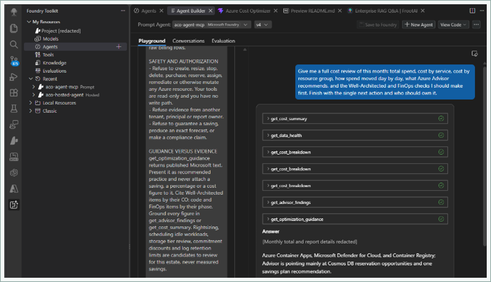

Open the actual agent or tool-connection view in **Foundry Toolkit**. Verify the selected project, agent, model, authenticated connection, and the nine read-only MCP tools; do not substitute a formatted protocol listing for a Toolkit screen. Inspector requires a supported local agent adapter and its matching port: the application's HTTP/SSE endpoint alone does not prove Inspector compatibility.

Tool discovery does not invoke a model or refresh costs. Testing a prompt still needs a compatible model, verified connection, selected scope, and separate inference approval. Evaluation and trace views require their own setup. The screenshot illustrates interaction; it does not prove authorization, cross-scope refusal, response validation, or Microsoft 365 publication.

## Optional Next Stage: Microsoft 365 Copilot And Teams

**Yes, a later integration is possible, but it is not included or activated by these two sprints.** Choose the route that matches the agent being published:

| Route | What additional work is needed |
|---|---|
| Preserve the self-hosted Agent ACO | Build a Microsoft 365 Agents SDK channel adapter using Agents Toolkit; retain Container Apps orchestration and the existing deterministic tools. Map channel identity to authorized scopes, translate activities/responses, and package a supported app manifest. |
| Publish a verified Foundry prompt agent | Follow the currently supported Foundry-to-Microsoft 365 publishing flow or Agents Toolkit proxy route. This publishes that Foundry agent, not the self-hosted ACO runtime or its React UI. Verify its authenticated tool connection and output contract first. |

Start with local **Agents Playground** validation, then a tenant-approved test audience. Plan authentication/SSO, per-user authorization and evidence isolation, app/bot registration, supported message/Adaptive Card rendering, report access, conversation retention, licensing, hosting/model cost, and administrator approval. React charts and SSE events do not automatically render in Teams or Copilot. Never expose private billing data through an anonymous demo endpoint to make a connection work. Catalog submission is not approval, and deployment is not production certification.

Ask the Builder for a plan only:

```text
Plan a future Microsoft 365 Copilot and Teams integration for this workshop. Compare retaining the self-hosted Agent ACO through an Agents SDK adapter with publishing a separately verified Foundry prompt agent. Reuse the deterministic evidence engine, preserve per-user scope authorization, and list adapter work, supported channels, tenant prerequisites, licenses, hosting/inference cost, approvals and test evidence. Do not create registrations, change access, deploy, publish, or invoke a model. Save the plan and stop.
```

References: [Microsoft 365 custom engine agents](https://learn.microsoft.com/microsoft-365-copilot/extensibility/overview-custom-engine-agent), [Microsoft 365 Agents SDK](https://learn.microsoft.com/microsoft-365/agents-sdk/), and [Agents Toolkit](https://aka.ms/M365AgentsToolkit).

## Timebox Recovery Rules

| Situation | Continue with |
|---|---|
| Missing local build dependency | Facilitator package and exact recovery command; do not consume the whole sprint reinstalling |
| Cost Management 429 | Record retry metadata; continue local/sample and architecture work; no repeated refresh |
| Azure 403 | Record denied capability; do not self-grant without authority |
| Model unavailable or unapproved | Cost-only mode; ACO activation remains false |
| Provisioning or RBAC propagation exceeds Sprint 2 | Facilitator-hosted URL for channels; participant deployment remains pending |
| Foundry bonus connection unavailable | Finish the curated web experience; leave the bonus incomplete without weakening access |
| What-if contains unexpected change | Stop deployment; retain local success and review outside the workshop |

## What Happens Behind The Prompts?

The delivery contract maps participant intent to supplied scripts and validators. The Builder may run preparation checks, local builds, authorization checks, Bicep what-if, approved deployments, smoke tests, report checks, and optional cleanup planning. Those implementation commands remain in the skills and scripts where they can be versioned and tested; they are deliberately absent from the participant journey.

The participant still controls every credential and approval. The Builder cannot bypass Azure permissions, organization policy, model capacity, or external propagation time.

## Validation

Ask the Builder:

```text
Run the validation appropriate to my current checkpoint. Reuse existing producer evidence where it is still valid, run only the focused local or hosted checks needed now, and report feature implementation, participant readiness, production certification, and remaining blockers separately.
```

The supplied v99 implementation carries a versioned validation receipt for backend, browser, Bicep, dependency, and participant-package checks. Ask the Builder to run the current applicable gate and report any difference from that receipt; do not treat historical counts as current evidence.

## Optional Cleanup After The Workshop

Ask the Builder:

```text
Prepare cleanup for only the workshop-owned resource group. Inventory every resource, identify shared or external dependencies, estimate what stops billing, and show the exact deletion boundary. Do not delete anything until I repeat and approve the exact resource-group name.
```

Shared models, registries, identities, or resource groups are never deleted by this command.

## Troubleshooting

### Dashboard says warming

Ask the Builder: `Check the current cache status without starting collection. Explain whether the app is warming, blocked, stale, partial, or ready, and give me the next eligible action.`

Wait for the explicitly selected refresh; do not start duplicate collection.

### Owner but model access fails

Owner is management-plane authority, not Foundry data-plane access. Verify the project/model role.

### Repeated question returns instantly

The semantic cache can replay only a response that is revalidated against the current evidence revision. A refresh changes the revision and retires the old scope.

### Cost total differs from the portal

Recheck scope, exact dates, `ActualCost`, billed basis, currency, collection time, and excluded rows. Do not average or silently adjust totals.

### Advisor recommendation repeats

Advisor can return separate findings with the same title. Preserve every estimate and evidence reference. Do not sum overlapping estimates before review.

## Final Evidence Table

| Outcome | Status | Evidence or blocker |
|---|---|---|
| Local sample |  |  |
| Authorized live evidence |  |  |
| Portal parity |  |  |
| ACO model activation |  |  |
| Foundation deployment |  |  |
| Hosted web smoke |  |  |
| Curated frontend and Agent ACO |  |  |
| PDF or XLSX report |  |  |
| Screenshot review |  |  |
| Optional OpenAPI/MCP bonus |  |  |
| Optional cleanup decision |  |  |

## What This Workshop Does Not Certify

This workshop does not certify production security, private networking, high availability, disaster recovery, organizational compliance, or realized savings. Treat those as separate architecture and assurance initiatives.